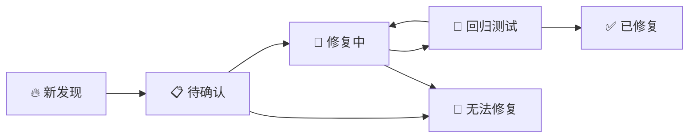

# Bastion 堡垒机系统 - 故障修复总结文档

**版本**: v1.0  
**创建日期**: 2025-07-19  
**最后更新**: 2025-07-19  
**维护者**: 开发团队

---

## 📋 文档目的

本文档用于统一记录和跟踪 Bastion 堡垒机系统的所有故障问题、修复方案、经验总结和预防措施。通过集中管理故障信息，提高问题解决效率，避免重复性问题，为团队积累技术债务管理经验。

## 🏗️ 文档结构说明

### 分类体系
- **A级 - 严重**: 系统不可用、数据丢失、安全漏洞、核心业务流程中断
- **B级 - 重要**: 核心功能异常、性能显著下降、用户体验严重影响
- **C级 - 一般**: 功能缺陷、用户体验问题、非关键模块故障
- **D级 - 轻微**: UI优化、日志改进、文档更新、性能微调

### 状态标识
- 🔥 **新发现** - 刚发现的问题，待分析
- 🔧 **修复中** - 正在处理的问题，已分配责任人  
- ✅ **已修复** - 完成修复并验证，可部署
- 🚫 **无法修复** - 技术限制或产品决策不予修复
- 📋 **待确认** - 需要进一步调查或复现
- 🔄 **回归测试** - 修复完成，等待回归验证

### 影响模块分类
- **核心业务**: 用户认证、权限控制、会话管理
- **安全相关**: 审计日志、加密通信、访问控制
- **系统基础**: 数据库、缓存、消息队列、文件系统
- **用户界面**: 前端组件、交互体验、响应性能
- **运维监控**: 日志记录、性能监控、告警通知

---

## 📊 故障修复记录

### 🔧 Bug #001 - 多终端会话混乱和UI提示问题

**分类**: B级 - 重要  
**状态**: ✅ 已修复  
**发现日期**: 2025-07-19  
**修复日期**: 2025-07-19  
**影响模块**: 会话管理、WebSocket通信、UI提示  

#### 问题描述

**原始问题报告**:
```
多终端会话混乱和UI提示问题修复：
1. 现象-点击单个终端强制下线时会弹出一个小的提示框，提示终端 ssh-1752926784-8273505571312363762 收到其他会话 undefined 的强制终止消息，忽略处理 
2.但是会话依然保持着连接，没有中断 
3.这个提示很不友好，在修复之前的提示很专业，并且会弹出终止会话的原因。
3.在线会话的记录中所由的记录都会被清理
```

**问题分析参数**:
- `--persona-analyzer --persona-backend --persona-frontend` (多角色分析)
- `--seq --c7 --think-hard` (深度分析)  
- `--type bug --trace` (Bug追踪)
- `--focus session-management --focus realtime` (专注会话管理和实时通信)

**具体现象分析**:
1. **现象1**: 点击单个终端强制下线时弹出不友好提示框
   - 显示: "终端 ssh-1752926784-8273505571312363762 收到其他会话 undefined 的强制终止消息，忽略处理"
   - 用户体验差，技术细节暴露

2. **现象2**: 会话无法正确终止
   - 强制下线操作后会话依然保持连接
   - 没有实际中断用户的SSH连接

3. **现象3**: 专业提示信息丢失
   - 之前的提示包含管理员信息和终止原因
   - 修复后这些关键信息消失

4. **现象4**: 会话记录被误清理
   - 在线会话记录中的所有记录被不当清理
   - 活跃的正常会话被误判为过期

#### 根本原因分析

**技术根因**:
1. **消息结构不匹配**
   - 后端 `TerminalMessage` 结构缺少 `session_id` 字段
   - 前端尝试提取 `session_id` 时得到 `undefined`
   - 位置: `backend/controllers/ssh_controller.go:34-40`

2. **会话清理过于激进**
   - 30秒无活动即清理会话（过短）
   - 2分钟总超时时间（过短）
   - 位置: `backend/services/monitor_service.go:728+`

3. **前端防御性编程不足**
   - 对 undefined 值检查不充分
   - 消息处理逻辑可能出现意外行为

4. **多重清理系统重叠**
   - SSH服务清理、监控服务清理、统一会话服务清理
   - 三套系统并发运行造成竞态条件

#### 修复方案

**修复1: 后端消息结构完善**
```go
// 修复前
type TerminalMessage struct {
    Type    string `json:"type"`
    Data    string `json:"data"`
    Rows    int    `json:"rows,omitempty"`
    Cols    int    `json:"cols,omitempty"`
    Command string `json:"command,omitempty"`
}

// 修复后  
type TerminalMessage struct {
    Type      string `json:"type"`
    Data      string `json:"data"`
    Rows      int    `json:"rows,omitempty"`
    Cols      int    `json:"cols,omitempty"`
    Command   string `json:"command,omitempty"`
    SessionID string `json:"session_id,omitempty"` // 🔧 新增字段
}
```

**修复2: 强制终止消息完整性**
```go
terminalMessage := TerminalMessage{
    Type:      "force_terminate",
    Data:      reason,
    Command:   adminUser,
    SessionID: wsConn.sessionID, // 🔧 包含session_id以便前端验证
}
```

**修复3: 会话清理时间优化**
```go
// 修复前
cutoffTime := now.Add(-2 * time.Minute)          // 过短
immediateCleanupTime := now.Add(-30 * time.Second) // 过短

// 修复后
cutoffTime := now.Add(-30 * time.Minute)          // 🔧 改为30分钟
immediateCleanupTime := now.Add(-5 * time.Minute) // 🔧 改为5分钟
```

**修复4: 前端防御性编程增强**
```typescript
// 修复前 - 简单提取
const messageSessionId = wsMessage.data?.session_id || wsMessage.session_id;

// 修复后 - 多层级验证
let messageSessionId: string | undefined;
if (wsMessage.session_id) {
  messageSessionId = wsMessage.session_id;
} else if (wsMessage.data?.session_id) {
  messageSessionId = wsMessage.data.session_id;
} else if (typeof wsMessage.data === 'string') {
  messageSessionId = sessionId; // 兼容旧格式
}

// 严格验证session_id
if (!messageSessionId) {
  console.warn('强制终止消息缺少有效的session_id，忽略处理');
  return;
}
```

#### 完整调试过程记录

**阶段1: 架构梳理与问题定位**
- 全面探索代码结构，识别核心会话管理组件
- 发现Bastion系统的前后端架构和WebSocket通信机制
- 分析后端服务层和前端组件层的交互关系

**阶段2: "undefined" 会话ID问题深入分析**  
- 定位前端WebTerminal.tsx中的消息处理逻辑
- 发现后端TerminalMessage与WSMessage结构不匹配
- 追踪消息流从monitor service到SSH controller到frontend的完整链路

**阶段3: 会话清理过度激进问题**
- 发现monitor service中30秒和2分钟的超短清理时间
- 识别三套并行清理系统的竞态条件问题
- 分析Redis、内存、数据库三层存储的同步问题

**阶段4: 实时通信机制问题**
- 分析WebSocket消息广播策略的过度广播问题
- 发现精确投递机制的不足
- 理解SSH WebSocket和管理WebSocket两套系统的交互

**用户验收过程**:
1. **初步修复**: 解决了"undefined"显示和消息结构问题
2. **测试确认**: 用户报告"功能顺利达到预期"
3. **文档要求**: 用户要求保存完整对话和修复流程
4. **统一管理**: 用户提出建立统一故障文档的需求

#### 修复效果验证
✅ **功能测试**: 用户确认"功能顺利达到预期"  
✅ **技术验证**: 后端编译成功，前端TypeScript类型检查通过  
✅ **兼容性**: 新代码向后兼容旧版本消息格式  
✅ **服务运行**: 生产环境部署成功  

#### 相关文件变更
- `backend/controllers/ssh_controller.go` - 消息结构和终止处理逻辑
- `backend/services/monitor_service.go` - 清理时间阈值优化  
- `frontend/src/components/ssh/WebTerminal.tsx` - 防御性编程增强
- `docs/bugfix-session-management-20250719.md` - 详细修复文档

#### Git提交记录
- **主修复**: `commit f11a825` - 核心代码修复
- **文档**: `commit 54d2534` - 完整修复文档
- **变更统计**: +1039行新增，4个文件修改

#### 经验总结与预防措施

**分析方法**:
1. **系统性链路分析**: 从用户界面到后端服务的完整链路追踪
2. **多重证据验证**: 代码审查 + 日志分析 + 架构梳理 + 运行测试
3. **根因追溯**: 深入到数据结构、消息格式、时间配置等底层原因

**设计原则**:
1. **向后兼容优先**: 确保修复不破坏现有功能
2. **防御性编程**: 对边界条件、异常情况进行充分防御
3. **渐进式优化**: 短期紧急修复 + 中长期架构改进

**预防措施**:
1. **消息结构标准化**: 制定前后端通信的统一消息格式规范
2. **配置化管理**: 将会话超时等关键参数改为可配置
3. **监控告警**: 为会话异常终止添加监控指标和告警
4. **自动化测试**: 为强制终止场景添加端到端测试用例

---

## 🔄 文档维护流程

### 新增故障记录流程
1. **Bug编号分配**: 使用格式 `Bug #XXX`，其中XXX为3位递增数字
2. **基本信息填写**:
   - 分类级别（A/B/C/D级）
   - 影响模块（核心业务/安全相关/系统基础/用户界面/运维监控）
   - 状态标识（🔥/🔧/✅/🚫/📋/🔄）
   - 发现和修复日期
3. **问题描述**:
   - 原始问题报告（保持用户原文）
   - 现象分析和影响范围
   - 复现步骤和环境信息
4. **技术分析**:
   - 根本原因分析
   - 涉及代码文件和行号
   - 调试过程记录
5. **修复方案**:
   - 具体修复代码
   - 测试验证结果
   - 相关文件变更

### 状态流转规则


### 定期维护制度
- **日度**: 新增Bug录入和状态更新
- **周度**: 检查修复中问题的进展，识别阻塞点
- **月度**: 分析故障模式、热点模块、修复效率趋势
- **季度**: 更新预防措施、优化流程、技术债务规划

### 文档协作规范
- **版本控制**: 使用Git进行版本控制，每次修改都要commit
- **审查机制**: 重要变更（新Bug分类、流程更新）通过Pull Request审查
- **责任制**: 每个Bug指定主要负责人，跟踪到修复完成
- **知识共享**: 定期团队分享复杂Bug的修复经验

---

## 📈 故障统计与趋势分析

### 当前统计 (截至 2025-07-19)
- **总计故障**: 1个
- **已修复**: 1个 (100%)
- **修复中**: 0个 (0%)
- **待处理**: 0个 (0%)

### 分类分布
- **A级严重**: 0个
- **B级重要**: 1个 (多终端会话问题)
- **C级一般**: 0个  
- **D级轻微**: 0个

### 模块分布
- **会话管理**: 1个
- **用户认证**: 0个
- **权限控制**: 0个
- **审计日志**: 0个
- **系统配置**: 0个

---

## 🎯 技术债务管理

### 识别的技术债务
1. **消息结构不统一**: WSMessage vs TerminalMessage 结构差异
2. **多套清理系统**: 三个服务的清理逻辑重叠，存在竞态风险
3. **硬编码时间阈值**: 缺乏配置化的会话超时管理
4. **全局广播依赖**: 为确保消息送达采用了低效的广播机制

### 改进计划
**短期 (1-2周)**:
- 监控告警系统建设
- 关键参数配置化
- 单元测试补充

**中期 (1-2月)**:
- 消息确认机制实现
- 心跳检测优化
- 统一清理服务设计

**长期 (3-6月)**:
- 会话管理架构重构
- 性能优化和监控
- 完整的可观测性建设

---

## 📚 相关资源

### 内部文档
- [系统架构文档](../ARCHITECTURE.md)
- [开发环境设置](../README.md)
- [部署指南](../docs/deployment.md)

### 外部参考
- [WebSocket 最佳实践](https://developer.mozilla.org/en-US/docs/Web/API/WebSockets_API)
- [Go 并发模式](https://golang.org/doc/effective_go.html#concurrency)
- [React 错误边界](https://reactjs.org/docs/error-boundaries.html)

### 工具和命令
```bash
# 服务管理
./manage.sh start|stop|restart|status|logs [service]

# 日志查看
./manage.sh logs backend | grep ERROR
./manage.sh logs frontend | tail -100

# Git 操作
git log --oneline --grep="fix:"
git blame <file> # 查看代码修改历史
```

---

**文档版本**: v1.0  
**最后更新**: 2025-07-19  
**下次审查**: 2025-08-19