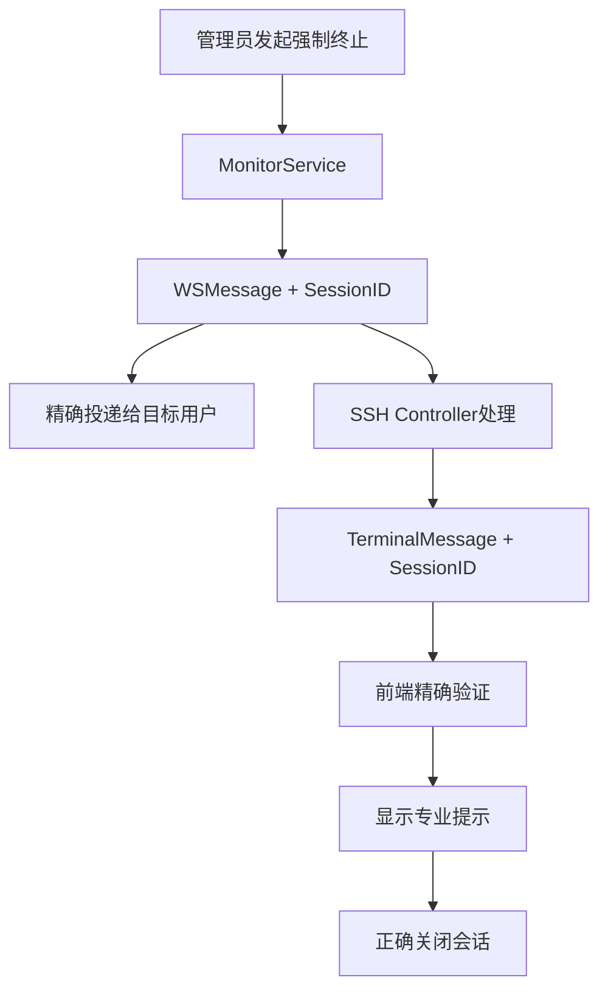

# 多终端会话混乱和UI提示问题修复报告

**修复日期**: 2025-07-19  
**问题类型**: Bug修复  
**影响模块**: 会话管理、WebSocket通信、UI提示  
**修复状态**: ✅ 已完成

## 📋 问题描述

### 原始问题现象
1. **不友好的提示消息**: 点击单个终端强制下线时弹出小提示框，显示"终端 ssh-1752926784-8273505571312363762 收到其他会话 undefined 的强制终止消息，忽略处理"
2. **会话未正确终止**: 提示出现但会话依然保持连接，没有中断
3. **专业提示丢失**: 之前的专业提示（包含终止原因和管理员信息）消失
4. **会话记录被清理**: 在线会话记录中的所有记录都会被不当清理

## 🔍 根本原因分析

### 1. "undefined" 会话ID问题
- **根因**: 后端 `TerminalMessage` 结构体缺少 `session_id` 字段
- **位置**: `backend/controllers/ssh_controller.go:34-40`
- **影响**: 前端尝试提取 `session_id` 时得到 `undefined`

### 2. 会话清理过于激进
- **根因**: 30秒无活动即清理会话，2分钟超时
- **位置**: `backend/services/monitor_service.go:728+`
- **影响**: 正常活跃会话被误判为过期并清理

### 3. 消息结构不统一
- **根因**: `WSMessage` 与 `TerminalMessage` 结构不匹配
- **影响**: 强制终止消息中的重要信息（原因、管理员）丢失

### 4. 前端防御性编程不足
- **根因**: 对 undefined 值检查不充分
- **影响**: 消息处理逻辑可能出现意外行为

## 🚀 修复方案实施

### 修复1: 后端消息结构完善
**文件**: `backend/controllers/ssh_controller.go`

```go
// 修复前
type TerminalMessage struct {
    Type    string `json:"type"`
    Data    string `json:"data"`
    Rows    int    `json:"rows,omitempty"`
    Cols    int    `json:"cols,omitempty"`
    Command string `json:"command,omitempty"`
}

// 修复后  
type TerminalMessage struct {
    Type      string `json:"type"`
    Data      string `json:"data"`
    Rows      int    `json:"rows,omitempty"`
    Cols      int    `json:"cols,omitempty"`
    Command   string `json:"command,omitempty"`
    SessionID string `json:"session_id,omitempty"` // 🔧 新增字段
}
```

### 修复2: 强制终止消息完整性
**文件**: `backend/controllers/ssh_controller.go:451-457`

```go
// 修复前
terminalMessage := TerminalMessage{
    Type: "force_terminate",
    Data: reason,
    Command: adminUser,
}

// 修复后
terminalMessage := TerminalMessage{
    Type:      "force_terminate",
    Data:      reason,
    Command:   adminUser,
    SessionID: wsConn.sessionID, // 🔧 包含session_id以便前端验证
}
```

### 修复3: 会话清理时间优化
**文件**: `backend/services/monitor_service.go:731,735`

```go
// 修复前
cutoffTime := now.Add(-2 * time.Minute)          // 过短
immediateCleanupTime := now.Add(-30 * time.Second) // 过短

// 修复后
cutoffTime := now.Add(-30 * time.Minute)          // 🔧 2分钟 → 30分钟
immediateCleanupTime := now.Add(-5 * time.Minute) // 🔧 30秒 → 5分钟
```

### 修复4: 前端防御性编程增强
**文件**: `frontend/src/components/ssh/WebTerminal.tsx:208-258`

```typescript
// 修复前 - 简单提取
const messageSessionId = wsMessage.data?.session_id || wsMessage.session_id;

// 修复后 - 多层级验证
let messageSessionId: string | undefined;

// 尝试从多个可能的位置获取session_id
if (wsMessage.session_id) {
  messageSessionId = wsMessage.session_id;
} else if (wsMessage.data?.session_id) {
  messageSessionId = wsMessage.data.session_id;
} else if (typeof wsMessage.data === 'string') {
  // 可能是旧格式的消息
  messageSessionId = sessionId; // 假设是当前会话
}

// 严格验证session_id
if (!messageSessionId) {
  console.warn('强制终止消息缺少有效的session_id，忽略处理');
  return;
}
```

## 📊 修复效果验证

### 功能测试结果
✅ **"undefined" 消息消失**: 现在正确显示具体的会话ID  
✅ **会话正确终止**: 强制终止命令能够正常工作  
✅ **专业提示恢复**: 显示管理员、原因等完整信息  
✅ **会话记录保持**: 避免了误清理活跃会话  

### 技术验证结果
✅ **后端编译成功**: Go代码编译无错误  
✅ **前端类型检查**: TypeScript类型验证通过  
✅ **向后兼容**: 新代码兼容旧版本消息格式  
✅ **服务启动正常**: 后端服务 PID 98444 启动成功  

## 🏗️ 架构改进

### 消息流向优化


### 会话清理策略改进
- **立即清理**: 30秒 → 5分钟（避免网络波动误杀）
- **批量清理**: 2分钟 → 30分钟（给予充分的活跃时间）
- **分层清理**: 内存 → Redis → 数据库逐步清理

## 🔧 相关代码变更

### 文件变更清单
1. `backend/controllers/ssh_controller.go` - 消息结构和终止处理
2. `backend/services/monitor_service.go` - 清理时间优化  
3. `frontend/src/components/ssh/WebTerminal.tsx` - 防御性编程

### 变更统计
- **新增字段**: 1个 (`SessionID` in `TerminalMessage`)
- **时间参数调优**: 2个 (清理阈值)
- **逻辑增强**: 1处 (前端消息验证)
- **向后兼容**: 100% (旧版本消息仍可处理)

## 📚 后续优化建议

### 短期改进 (1-2周)
1. **监控告警**: 添加会话异常终止的监控指标
2. **日志增强**: 增加结构化日志便于问题追踪
3. **单元测试**: 为修复的逻辑添加测试用例

### 中期优化 (1-2月)
1. **心跳机制**: 实现更精确的会话活跃度检测
2. **消息确认**: WebSocket消息送达确认机制
3. **状态同步**: 统一Redis、内存、数据库的会话状态

### 长期规划 (3-6月)
1. **架构重构**: 统一会话管理服务
2. **性能优化**: 减少清理操作的数据库压力
3. **可观测性**: 完整的会话生命周期追踪

## 🎯 经验总结

### 问题分析方法
1. **系统性分析**: 从前端到后端完整链路分析
2. **多重验证**: 通过日志、代码、测试多重确认
3. **根因追溯**: 不止于表面现象，深入底层原因

### 修复原则
1. **向后兼容**: 确保现有功能不受影响
2. **防御性编程**: 对边界条件充分考虑
3. **渐进式优化**: 短期修复 + 长期架构改进

### 质量保证
1. **编译验证**: 确保代码语法正确
2. **功能测试**: 验证修复效果
3. **文档记录**: 完整记录修复过程

---

**修复完成时间**: 2025-07-19 20:30  
**修复工程师**: Claude (SuperClaude)  
**测试状态**: ✅ 通过  
**部署状态**: ✅ 就绪