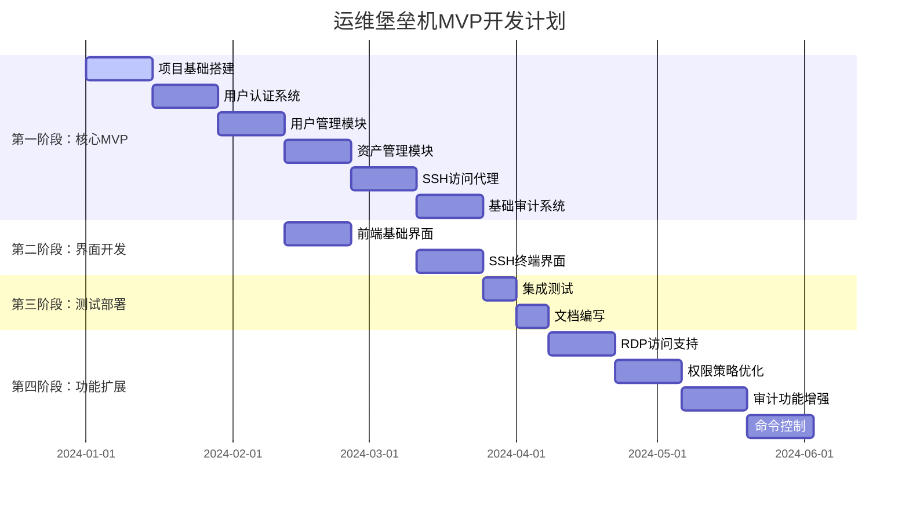
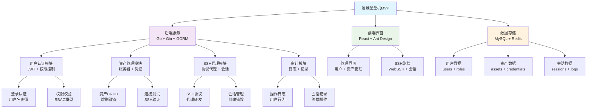
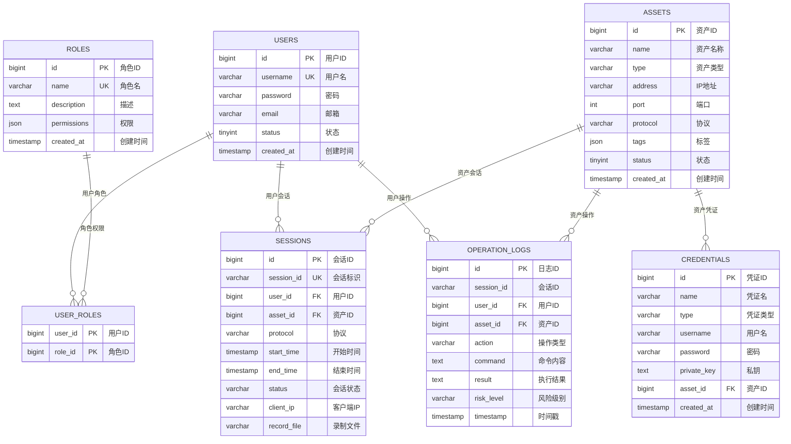
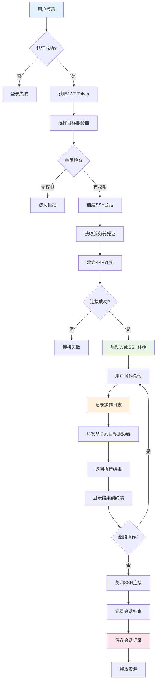
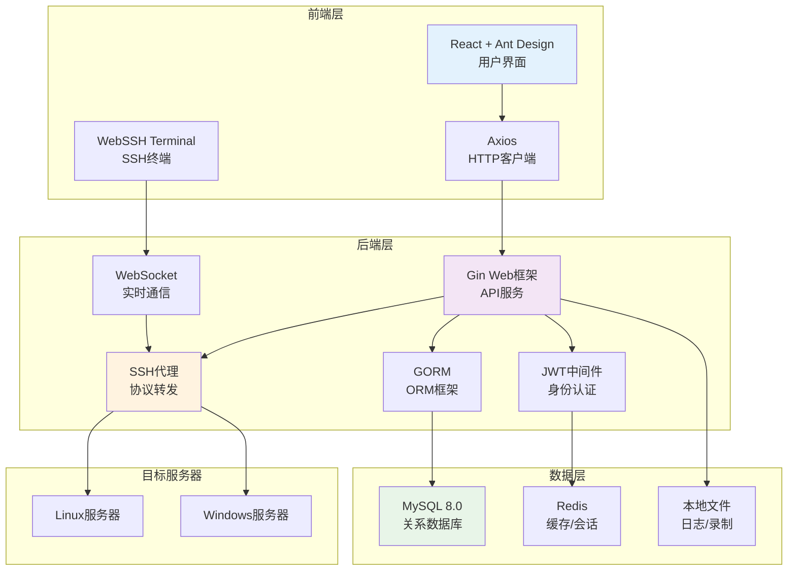

# 运维堡垒机系统 - 项目架构图表集

## 📋 图表目录

1. [项目开发计划甘特图](#1-项目开发计划甘特图)
2. [系统功能模块关系图](#2-系统功能模块关系图)
3. [数据库实体关系图](#3-数据库实体关系图)
4. [SSH访问业务流程图](#4-ssh访问业务流程图)
5. [技术架构层次图](#5-技术架构层次图)
6. [项目目录结构图](#6-项目目录结构图)

---

## 1. 项目开发计划甘特图

### 📅 **用途说明**
展示MVP版本的完整开发时间线，包括4个主要阶段和16周的详细进度安排。

### 🎯 **关键信息**
- **第一阶段**: 核心MVP功能开发（12周）
- **第二阶段**: 前端界面开发（并行进行）
- **第三阶段**: 测试部署（2周）
- **第四阶段**: 功能扩展（8周）

---

## 2. 系统功能模块关系图

### 📊 **用途说明**
展示运维堡垒机系统的整体架构和各模块之间的关系，包括后端、前端、数据存储三层架构。

### 🎯 **关键信息**
- **后端服务**: 6个核心模块（认证、管理、代理、审计）
- **前端界面**: 2个主要界面（管理界面、SSH终端）
- **数据存储**: 3类数据（用户、资产、会话）

---

## 3. 数据库实体关系图

### 🗃️ **用途说明**
展示MySQL数据库的核心表结构和表之间的关系，包括用户管理、资产管理、会话审计等数据模型。

### 🎯 **关键信息**
- **用户体系**: users, roles, user_roles（多对多关系）
- **资产体系**: assets, credentials（一对多关系）
- **审计体系**: sessions, operation_logs（关联用户和资产）

---

## 4. SSH访问业务流程图

### 🔄 **用途说明**
展示用户通过堡垒机进行SSH访问的完整业务流程，从登录认证到会话结束的全过程。

### 🎯 **关键信息**
- **认证流程**: 用户登录 → JWT验证 → 权限检查
- **连接流程**: 选择服务器 → 建立SSH连接 → 启动WebSSH
- **审计流程**: 记录操作 → 保存会话 → 释放资源

---

## 5. 技术架构层次图

### 🏗️ **用途说明**
展示系统的技术架构分层，从前端到后端再到数据层的完整技术栈和组件关系。

### 🎯 **关键信息**
- **前端层**: React + Ant Design + WebSSH终端
- **后端层**: Gin + JWT + GORM + SSH代理 + WebSocket
- **数据层**: MySQL + Redis + 本地文件存储
- **目标层**: Linux/Windows服务器

---

## 6. 项目目录结构图

### 📁 **用途说明**
展示完整的项目文件和目录结构，包括后端Go服务和前端React应用的代码组织方式。

### 🎯 **关键信息**
- **后端结构**: 按MVC模式组织，包含models、controllers、services等
- **前端结构**: 按功能模块组织，包含components、pages、services等
- **配置文件**: docker-compose.yml用于部署配置

```mermaid
graph TD
    A[bastion/] --> B[backend/]
    A --> C[frontend/]
    A --> D[docker-compose.yml]
    A --> E[README.md]
    
    B --> F[main.go]
    B --> G[config/]
    B --> H[models/]
    B --> I[controllers/]
    B --> J[services/]
    B --> K[middleware/]
    B --> L[routers/]
    B --> M[utils/]
    
    G --> N[config.yaml]
    G --> O[database.go]
    
    H --> P[user.go]
    H --> Q[asset.go]
    H --> R[session.go]
    H --> S[log.go]
    
    I --> T[auth.go]
    I --> U[user.go]
    I --> V[asset.go]
    I --> W[ssh.go]
    I --> X[audit.go]
    
    J --> Y[auth_service.go]
    J --> Z[ssh_service.go]
    J --> AA[audit_service.go]
    
    K --> BB[jwt.go]
    K --> CC[cors.go]
    K --> DD[logger.go]
    
    L --> EE[routes.go]
    L --> FF[api.go]
    
    M --> GG[crypto.go]
    M --> HH[validator.go]
    
    C --> II[src/]
    C --> JJ[public/]
    C --> KK[package.json]
    
    II --> LL[components/]
    II --> MM[pages/]
    II --> NN[services/]
    II --> OO[utils/]
    
    LL --> PP[Header.tsx]
    LL --> QQ[Sidebar.tsx]
    LL --> RR[Terminal.tsx]
    
    MM --> SS[Login.tsx]
    MM --> TT[Dashboard.tsx]
    MM --> UU[AssetList.tsx]
    MM --> VV[UserList.tsx]
    MM --> WW[SSH.tsx]
    
    NN --> XX[api.ts]
    NN --> YY[auth.ts]
    
    OO --> ZZ[request.ts]
    OO --> AAA[constants.ts]
    
    style A fill:#e1f5fe
    style B fill:#f3e5f5
    style C fill:#e8f5e8
    style D fill:#fff3e0
```

---

## 📚 图表使用说明

### 1. **项目管理使用**
- **甘特图**: 用于项目进度跟踪和里程碑管理
- **流程图**: 用于业务流程梳理和需求分析
- **架构图**: 用于技术方案讨论和代码设计

### 2. **开发参考使用**
- **模块图**: 指导代码模块划分和接口设计
- **ER图**: 指导数据库设计和SQL编写
- **目录图**: 指导项目结构创建和文件组织

### 3. **文档维护**
- 随着项目发展，及时更新相关图表
- 新增功能时，补充对应的流程图和架构图
- 重要变更时，更新数据库ER图和目录结构图

### 4. **团队协作**
- 在技术评审时使用架构图和流程图
- 在需求讨论时使用功能模块图
- 在项目汇报时使用甘特图和进度图

---

## 🔧 图表编辑工具

### 在线编辑工具
- **Mermaid Live Editor**: https://mermaid.live/
- **Draw.io**: https://app.diagrams.net/
- **Lucidchart**: https://www.lucidchart.com/

### 本地编辑工具
- **VSCode + Mermaid Preview**: 安装Mermaid Preview插件
- **Typora**: 支持Mermaid语法的Markdown编辑器
- **Obsidian**: 支持Mermaid的知识管理工具

---

**这些图表将为项目开发提供清晰的指导和参考！** 📊✨ 